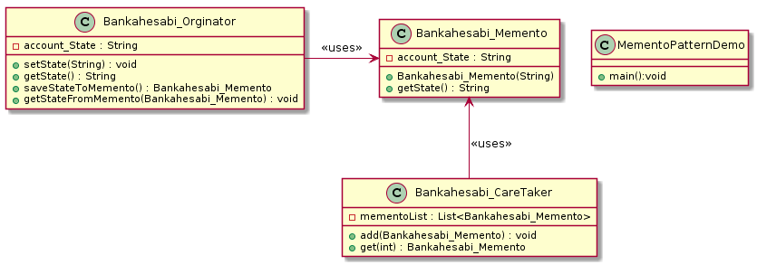

### * Memento Pattern :
Memento tasarım deseni behavior grubununa ait, bir nesnenin tamamının veya bazı özelliklerinin tutularak sonradan tekrar elde edilmesini yöneten tasarım desenidir. 
Memento tasarım deseni nesnenin bir halinin kopyasını alıp sonra bu kopyanın tekrar elde edilmesini sağlar. Genelde geri al işlemi için kullanılır. 

#### Memento tasarım deseni 3 yapıdan oluşur:

*  Originator: Tamamının veya bazı özelliklerinin kopyasının tutulacağı nesnedir. Memento nesnesini oluşturan ve geri yüklenmesinden sorumludur.

*  Memento: Originator nesnesinin saklanacak özelliklerinin tanımlı olduğu nesne.

*  Caretaker: Saklanacak olan memento nesnesinin referansını içinde barındıran nesnedir.

#### Örnek:
Örnek uygulamamızda Banka hesabi nesnesi olsun ve bu nesne üzerinde memento tasarım desenini uygulanmış olsun. Bu tasarımın önemi banka hesabinin geçmiş durumları kaydetmemizi sağlar, banka hesabinin durumları 3 durumdan oluşur (Açık, kapatıldı, donduruldu). Kullanıcı istediği zaman hesabinin geçmişini görüntüleyebilir. 

#### CODE:

.Class Bankahesabi_Memento.java
[source, java]
----
package Memento_pattern;

/// Bankahesabi_Memento Bankahesabi_Originator nesnesinin 
/// saklanacak özelliklerinin tanımlı olduğu nesne.

public class Bankahesabi_Memento {
	/// Burada banka hesabin durumu kaydedeilecektir ..
	private String account_State;
	
	public Bankahesabi_Memento(String account_State){
		this.account_State = account_State;
	}
	public String getState(){
		return account_State;
	}
	
}
----
.Bankahesabi_Orginator.java
[source, java]
----
//Tamamının veya bazı özelliklerinin kopyasının tutulacağı nesnedir. 
//Bankahesabi_Orginator Bankahesabi_Memento nesnesini oluşturan ve geri yüklenmesinden sorumludur.
public class Bankahesabi_Orginator {
	private String account_State;
	
	public void setState(String state){
		this.account_State=state;
	}
	public String getState(){
		return account_State;
	}
	public Bankahesabi_Memento saveStateToMemento(){
		return new Bankahesabi_Memento(account_State);
	}
	public void getStateFromMemento(Bankahesabi_Memento memento){
		account_State = memento.getState();
	}
	
}
----
.Bankahesabi_CareTaker.java
[source, java]
----
import java.util.ArrayList;
import java.util.List;

//Saklanacak olan memento nesnesinin referansını içinde barındıran nesnedir.

public class Bankahesabi_CareTaker {
	
	private List<Bankahesabi_Memento> mementoList = new ArrayList<Bankahesabi_Memento>();
	
	public void add(Bankahesabi_Memento m){
		mementoList.add(m);
	}
	public Bankahesabi_Memento get(int index){
		return mementoList.get(index);
	}
	
}
----
.MementoPatternDemo.java
[source, java]
----
public class MementoPatternDemo {

	public static void main(String[] args) {
		
		System.out.println("### Memento Design Pattern2's Example is Runing ###\n");
		
		Bankahesabi_Orginator orginator = new Bankahesabi_Orginator();
		Bankahesabi_CareTaker careTaker = new Bankahesabi_CareTaker();
		
		orginator.setState("Acik");
		Bankahesabi_Memento memento_1 = orginator.saveStateToMemento();
		careTaker.add(memento_1);
		
		orginator.setState("Kapatildi");
		Bankahesabi_Memento memento_2 = orginator.saveStateToMemento();
		careTaker.add(memento_2);

		orginator.setState("Donduruldu");
		System.out.println("Banka hesabinin şimdiki Durumu: "+orginator.getState());
		
		orginator.getStateFromMemento(careTaker.get(0));
		System.out.println("Hesabın Kaydedilen İlk Durumu: "+ orginator.getState());
		
		orginator.getStateFromMemento(careTaker.get(1));
		System.out.println("Hesabın Kaydedilen İkinci Durumu: "+ orginator.getState());

	
	}

}
----

#### Result:
[source, ]
----
### Memento Design Pattern2's Example is Runing ###

Banka hesabinin şimdiki Durumu: Donduruldu
Hesabın Kaydedilen İlk Durumu: Acik
Hesabın Kaydedilen İkinci Durumu: Kapatıldı
----

#### UML kodu:
[source, ]
----
@startuml

class Bankahesabi_Memento{
- account_State : String

+ Bankahesabi_Memento(String) 
+ getState() : String
}

Class Bankahesabi_Orginator{

- account_State : String

+ setState(String) : void
+ getState() : String
+ saveStateToMemento() : Bankahesabi_Memento
+ getStateFromMemento(Bankahesabi_Memento) : void
}

class Bankahesabi_CareTaker{
- mementoList : List<Bankahesabi_Memento>

+ add(Bankahesabi_Memento) : void
+ get(int) : Bankahesabi_Memento

}

class MementoPatternDemo{
+ main():void
}

Bankahesabi_Memento <-- Bankahesabi_CareTaker : <<uses>>

Bankahesabi_Orginator -> Bankahesabi_Memento : <<uses>>

@enduml