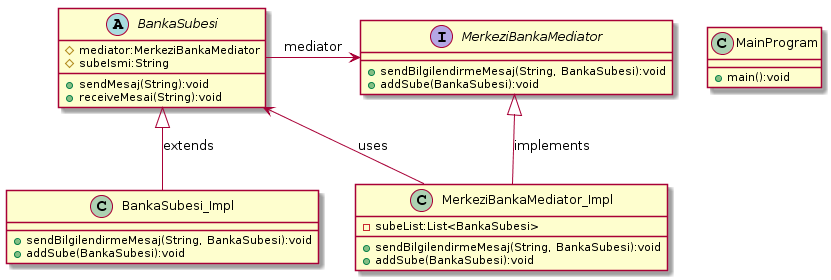

### * Mediator Pattern :

#### Mediator tasarım deseninde 4 temel yapı bulunur:

*  Mediator: Nesneler arasındaki ilişkiyi sağlayacak metotların tanımlı olduğu arayüz.

*  ConcreteMediator: Nesneler arasındaki ilişkiyi sağlayacak gerçek nesnedir. Mediator arayüzünü uygular. İçinde Colleague ara yüzünden türeyen nesnelerin listesini barındırır.

*  Colleague: ConcreteMediator'u kullanarak işlem gerçekleştirecek olan nesnelerin uygulaması gereken arayüzü temsil eder. Kendi içinde ConcreteMediator nesnesi barındırır.

*  ConcreteColleague: ConcreteMediator üzerinden birbirleri ile ilişkili nesnelerdir. Colleague arayüzünü uygularlar.

#### Örnek:
Örnek uygulamamızda Merkezi Banka nesnesi olsun bu Merkezi bankamız Meditaor(ara bulucu) sayılır, birden fazla Banka Şübeleri yönetmiş olsun,mesela
bir banka şübesi tarafından gönderilen bilgilerndirme mesajı diğer banka şübelere iletilme işlemini yönetilsin böylece
Mediator tasarım desenini uygulanmış oluruz. Bu tasarımın önemi nesneler arasındaki bağ zayıflatılır ve geliştirme
aşamasında kod karmaşasını önler ve kodun yönetilmesini kolaylaştırır.

#### CODE:

.BankaSubesi.java
[source, java]
----
public abstract class BankaSubesi {
	protected MerkeziBankaMediator mediator;
	protected String subeIsmi;
	
	public BankaSubesi(MerkeziBankaMediator mediator, String subeIsmi){
		this.mediator = mediator;
		this.subeIsmi = subeIsmi;
	}
	
	public abstract void sendMesaj(String mesaj);
	
	public abstract void receiveMesaj(String mesaj);
}
----
.BankaSubesi_Impl.java
[source, java]
----
package Mediator_Pattern;

public class BankaSubesi_Impl extends BankaSubesi{

	public BankaSubesi_Impl(MerkeziBankaMediator med, String mesaj){
		super(med,mesaj);
	}
	@Override
	public void sendMesaj(String mesaj) {
		
		System.out.println(this.subeIsmi + " Tarafından bu mesaj gönderildi : "+mesaj );
		mediator.sendBilgilendirmeMesaj(mesaj, this);
	}

	@Override
	public void receiveMesaj(String mesaj) {
		
		System.out.println(this.subeIsmi + " Tarafından bu mesaj alındı : "+mesaj );
	}

}
----
.MerkeziBankaMediator.java
[source, java]
----
package Mediator_Pattern;

public interface MerkeziBankaMediator {
	
	public void sendBilgilendirmeMesaj(String mesaj, BankaSubesi sube);
	void addSube(BankaSubesi sube);
}
----
.MerkeziBankaMediator_Impl.java
[source, java]
----
package Mediator_Pattern;

import java.util.ArrayList;
import java.util.List;

public class MerkeziBankaMediator_Impl implements MerkeziBankaMediator{

	private List<BankaSubesi> subeList;
	
	public MerkeziBankaMediator_Impl(){
		this.subeList = new ArrayList<>();
	}
	@Override
	public void sendBilgilendirmeMesaj(String mesaj, BankaSubesi sube) {
		
		for (BankaSubesi s : this.subeList){
			if (s != sube){
				s.receiveMesaj(mesaj);
			}
		}
		
	}

	@Override
	public void addSube(BankaSubesi sube) {
		this.subeList.add(sube);
	}

}
----
.MainProgram.java
[source, java]
----
package Mediator_Pattern;

public class MainProgram {
	
	public static void main(String[] args){
		
		System.out.println("### Mediator Design Pattern's Example is Runing ###\n");

		MerkeziBankaMediator mediator = new MerkeziBankaMediator_Impl();
		
		BankaSubesi sube_1 = new BankaSubesi_Impl(mediator, "Istanbul Banka Şübesi");
		BankaSubesi sube_2 = new BankaSubesi_Impl(mediator, "Ankara Banka Şübesi");
		BankaSubesi sube_3 = new BankaSubesi_Impl(mediator, "İzmir Banka Şübesi");
		BankaSubesi sube_4 = new BankaSubesi_Impl(mediator, "Bursa Banka Şübesi");
 
		mediator.addSube(sube_1);
		mediator.addSube(sube_2);
		mediator.addSube(sube_3);
		mediator.addSube(sube_4);
		
		sube_1.sendMesaj("Tüm Şübelerin Dikkatine 1. Bilgilendirme mesaji !!!");
	    System.out.print("\n");
		sube_4.sendMesaj("Tüm Şübelerin Dikkatine 2. Bilgilendirme mesaji !!!");

	}
}
----
#### Result:
[source, ]
----
### Mediator Design Pattern's Example is Runing ###

Istanbul Banka Subesi Tarafından bu mesaj gönderildi : Tüm Subelerin Dikkatine 1. Bilgilendirme mesaji !!!
Ankara Banka Subesi Tarafından bu mesaj alındı : Tüm Subelerin Dikkatine 1. Bilgilendirme mesaji !!!
İzmir Banka Subesi Tarafından bu mesaj alındı : Tüm Subelerin Dikkatine 1. Bilgilendirme mesaji !!!
Bursa Banka Subesi Tarafından bu mesaj alındı : Tüm Subelerin Dikkatine 1. Bilgilendirme mesaji !!!

Bursa Banka Subesi Tarafından bu mesaj gönderildi : Tüm Subelerin Dikkatine 2. Bilgilendirme mesaji !!!
Istanbul Banka Subesi Tarafından bu mesaj alındı : Tüm Subelerin Dikkatine 2. Bilgilendirme mesaji !!!
Ankara Banka Subesi Tarafından bu mesaj alındı : Tüm Subelerin Dikkatine 2. Bilgilendirme mesaji !!!
İzmir Banka Subesi Tarafından bu mesaj alındı : Tüm Subelerin Dikkatine 2. Bilgilendirme mesaji !!!

UML KODU

@startuml

interface MerkeziBankaMediator{

+ sendBilgilendirmeMesaj(String, BankaSubesi):void
+ addSube(BankaSubesi):void
}

abstract BankaSubesi{
# mediator:MerkeziBankaMediator
# subeIsmi:String
+ sendMesaj(String):void
+ receiveMesai(String):void
}
class MerkeziBankaMediator_Impl{
- subeList:List<BankaSubesi>
+ sendBilgilendirmeMesaj(String, BankaSubesi):void
+ addSube(BankaSubesi):void
}
class BankaSubesi_Impl{
+ sendBilgilendirmeMesaj(String, BankaSubesi):void
+ addSube(BankaSubesi):void
}
class MainProgram{
+ main():void
}
MerkeziBankaMediator <|-- MerkeziBankaMediator_Impl:implements
BankaSubesi <|-- BankaSubesi_Impl:extends

BankaSubesi -> MerkeziBankaMediator:mediator
BankaSubesi <-MerkeziBankaMediator_Impl:uses

@enduml

----
